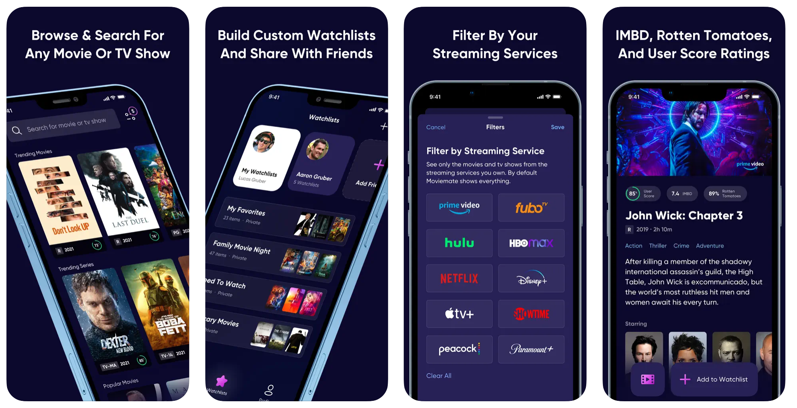
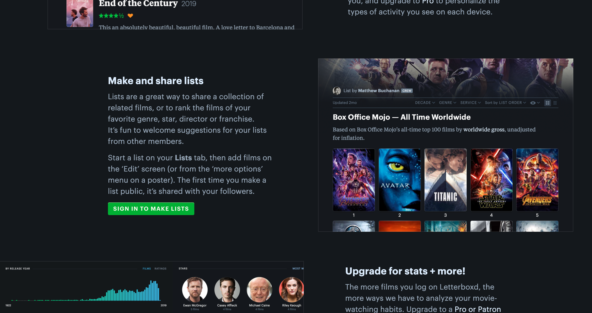

# DH 110 - Assignment 1

### Elissa Soykin, DH 110, Spring 2023

## Tentative Title: MovieList Collab

Within my family, movies (and cinema more broadly) are strong interests of ours. Although I love technical and computational disciplines professionally and in academics, one of my biggest personal passions and hobbies is film. I love watching movies, learning about film history, reading about the technical aspects required for making a film, performing critical analyses, and exploring different time periods, countries, and cultures through film. Luckily, my family is very interested in cinema too. My mom and dad have watched many more movies than other people I know have, own many books about film history, seek out filming locations, and enjoy discussing trivia. 

Watching movies together can be not only a bonding experience and simply a way to spend time together, but they can also be a vessel for cultural discussions and memories from a relative's childhood. Both my mom's and my dad's families immigrated to the US, and I grew up speaking two languages at home. I grew up on children's cartoons from my parent's era and homes; I later realized that some of them were pretty obscure and had a hard time trying to remember them and find them again. Then, as I got older, my parents and grandparents introduced me to live-action, drama films they watched in their teens and early adulthood. These films were like time capsules, showing me what daily life was like when and where they grew up. Even after moving to the US, movies and TV played an important role in my parents' lives, as my mom recounts to me the TV shows she watched to test her English and assimilate into American culture.

As a result, today I place much sentimental value on any movie and TV show recommendations my parents give me. They also tell me movies they would like to watch together. This could be neatly kept track of in a shared movie/TV show watchlist. However, I've found that there is a lack of platforms that implement collaborative, shared, group watchlists. While I could have focused on group calendars, budgets, or map diaries, these have existing implementations. Group watchlists seem to be a more unsolved problem. I will contribute to this gap with this UX project by creating a website or app that allows for families to create, maintain, and update group watchlists of movies and TV shows. First, I perform a heuristic evaluation of two platforms that attempt to provide a similar functionality.

## 1) Moviemate

Link to download: [Moviemate on App Store](https://apps.apple.com/us/app/moviemate-custom-watchlists/id1592231529)
#### Description
Moviemate is an app for iOS. Users first sign up and set up a profile. They then can create lists, and add movies and shows to their lists. Notably, a user can send invitations to other accounts to let them have access to that list. Everyone with access to a list can edit the list. Moviemate has some more features, such as being able to mark movies/shows as watched, and it also stores what streaming services a movie/show is available on, and allows you to filter by service.
#### Overall Evaluation
This was virtually the only app I could find that implemented what I desired. It does have a sleek, clean design, and it can more or less accomplish the most critical parts of the task at hand. However, it is lacking in various aspects. This is mostly because in many areas, it has a lack of features and flexibility. For example, users can't change the date they watched a movie, they can't change the order of items in a list, and they can't add items to a list from within the list itself. Also, the 3 buttons on the bottom ("Home", "Watchlists", and "Profile") disappear when clicking on even one movie, and if following a chain of similar movies afterwards. A pro is that it allows for both movies and TV shows, but a con is that it is only mobile-based and has no browser version.

### Heuristic Evaluation

| Heuristic & Description                                                                                                                                                     | Evaluation                                                                                                                                                                                                                                                                                                                                                                                                                                           | Recommendation for "Bad" Element(s)                                                                                                                                                    | Severity of "Bad" Element(s) |
| --------------------------------------------------------------------------------------------------------------------------------------------------------------------------- | ---------------------------------------------------------------------------------------------------------------------------------------------------------------------------------------------------------------------------------------------------------------------------------------------------------------------------------------------------------------------------------------------------------------------------------------------------- | ----------------------------------------------------------------------------------------------------------------------------------------------------------------------------------- | ------------------------- |
| **1\. Visibility of system status** The user is clearly informed about the app's current behind-the-scenes status                                                                            | **Good**: When you add a movie to a watchlist, a big pop-up with a green checkmark shows whether it was succesfully added. **Good**: By clicking on "Profile" on the bottom right, the user can see what account is signed in. **Bad**: When deleting a movie from a list, there is no indication of success or failure. | Implement a pop-up to notify a user whether a film was successfully deleted from a watchlist.                                                                | 2                         |
| **2\. Match between system and the real world** The app follows conventions that would be expected from the real world | **Good**: Movies can be marked as "watched". Movies that you add to a list from the "Home" page show up in that list. **Bad**: While the "Watchlists" and "Profile" page include the information you would expect, what is labeled the "Home" page is not very accurately described. The "Home" page is actually a list of movies and shows, that the user can search through and add to lists. Since the app is focused more on the lists themselves, it seems misleading or not representative to have the "Home" page be the set of searchable movies.                                                                                                                                                                                                                                                         | Make what is currently the "Watchlists" page the new "Home" page (with or without changing its name), and rename the current "Home" page to be "Movies".                                                                                      | 2                         |
| **3\. User control and freedom** Allow users to undo and redo accidental or undesired actions                                                                             | **Good**: You can switch a movie between "watched" and "unwatched" status via the button on the movie's page. **Bad**: There is no simple undo/redo button to undo/redo adding or removing a movie from a list. The only way to accomplish that is to find and delete the movie from the list, or research the movie and add it again.                                                                                                                                                                                                                                   | Add a pop-up that allows users to undo a successful movie addition/deletion to or from a list. Redo can be implemented by adding a "shake the phone" feature.                                                                                    | 2                         |
| **4\. Consistency and standards** The app follows conventions, and the elements, icons, and behaviors are consistent throughout the app                                                                                | **Good**: The movie page that comes up when you click on a movie within a list is the same as the movie page that comes up when you search for that movie from the "Home" page. The set of movies the user marked as "watched" are also consistent throughout the app. **Good**: The app incorporates movie posters, like other movie and show tracking platforms do. **Bad**: The navigation menu on the bottom ("Home", "Watchlists", "Profile") disappears after clicking on one movie and if clicking on any more movies. The only way to get back to seeing the bottom menu is to click all the back arrows until you exit from the first film you clicked on.                 | Make the bottom navigation menu always visible.                                              | 3                         |
| **5\. Error prevention** The app prevents and eliminates errors, and allows for users to recover from errors                                          | **Good**: If attempting to add a movie to a list which already contains that movie, a pop-up appears, telling the user they cannot add it again. **Bad**: If you make an edit in a list, even without clicking the "save" button, if you swipe the list down, those changes will be made to the list.                                                                                                                                                                                                                                                         | Either only allow for changes when clicking "save" or warn the user when they swipe down.                                                              | 1                         |
| **6\. Recognition rather than recall** A user does not have to memorize how to use the app; the options, actions, and items are presented as easily recognizable visual cues, or are intuitive to know                                              | **Good**: Most of the icons and the actions they represent are presented as simple visual icons; there is very little text in the controls of the app. For example, it uses plus signs, a magnifying glass, eyes, gears (settings), trash cans, and dot menus. **Good**: By using actual movie posters, users can rely on visual memory of the poster's appearance, and do not have to perfectly remember the movie's title.                                                                                                                                                                     | App is good.                                                                                                          | 0                         |
| **7\. Flexibility and efficiency of use** The app allows users to tailor frequent actions                                                     | **Bad**: There is nearly no customization available for users. The only actions allowed are those predefined by the app.                                                                                                                                                                                      | Allow users to enter arbitrary dates that they watched movies on. Allow them to change the order of items within a list.                        | 2                         |
| **8\. Aesthetic and minimalist design** The app does not contain extra, unneccessary features, and is visually pleasing                                   | **Good**: It is a very simple app, and includes only the most basic functionalities; there are no features I found that were rarely used. **Good**: The dark purple background, white font, readable font, and neat icons overall combine for a very clean, sleek, aesthetic app. **Bad**: None; if anything, the app has too few features.                                                                                                                                              | None.                                                                                                                                    | 0                         |
| **9\. Help users recognize, diagnose, and recover from errors** The app describes problems in non-technical language and suggests solutions                     | **Good**: If you try to add a movie to a list that already contains it, a pop-up box will explain that you cannot do that.                                                                                                                                                                                       | None.                                                | 0                         |
| **10\. Help and documentation** The app provides help resources such as documentation                                                                     | **Good**: The "Profile" page has an "About Moviemate" button, which provides a contact email. **Bad**: There is no documentation or instructions available, only one contact email.                                                                                                                                                                 | Provide some instructions, a tutorial, a few FAQs, or some documentation. | 3                         |

## 2) Letterboxd

Link: [Letterboxd](https://letterboxd.com/)
#### Description
Letterboxd is a comprehensive and popular website for logging, tracking, and making lists of movies. Users can sign up for a profile, browse through a large database of movies, create lists and add movies to lists, make the lists private or public, add movies to a built-in watchlist, mark movies as watched, add ratings and reviews for movies, log dates a movie was watched, and discover movies based on genres, tags, years, languages, countries, and more. Letterboxd has even more functionality, but these are the most frequently used. Note that a con is that Letterboxd only has movies and not TV shows, but a pro is that it has a browser version.
#### Overall Evaluation
I chose Letterboxd because it is the 'gold standard' in the film world for movie logging and tracking. It is impressive and comprehensive in the features and functionalities it offers. It is also visually pleasing, with a clean, modern aesthetic. However, Letterboxd can not accomplish my goal of creating a collaborative, shared, group watchlist. For one, Letterboxd lists are either private to only the creator or public to anyone on the internet. Second, even public lists do not allow for multiple editors. Furthermore, Letterboxd has some other issues. For example, the search bar is completely incapable of handling even a single typo in the name of a film, actor, director, etc. Also, there are many ads, which make it slow to load. One plus of Letterboxd which Moviemate does not have and would be especially important for a family app, is that you can add notes and descriptions to movies in lists.

### Heuristic Evaluation

| Heuristic & Description                                                                                                                                                     | Evaluation                                                                                                                                                                                                                                                                                                                                                                                                                                                                                                                                                                                                            | Recommendation for "Bad" Element(s)                                                                                                                                                                                    | Severity of "Bad" Element(s) |
| --------------------------------------------------------------------------------------------------------------------------------------------------------------------------- | --------------------------------------------------------------------------------------------------------------------------------------------------------------------------------------------------------------------------------------------------------------------------------------------------------------------------------------------------------------------------------------------------------------------------------------------------------------------------------------------------------------------------------------------------------------------------------------------------------------------- | ------------------------------------------------------------------------------------------------------------------------------------------------------------------------------------------------------------------- | ------------------------- |
| **1\. Visibility of system status** The user is clearly informed about the app's current behind-the-scenes status                                                                            | **Good**: The top right corner always shows whether you are signed in and which account if so. **Good**: Every addition of a movie to a list, and every save of a list, prompt success boxes with green checkmarks to pop up. **Bad**: None; the success indicators are pretty comprehensive.                                                                                                                                                                                                                                                                                                          | None.                                                                                                                                                                                 | 0                         |
| **2\. Match between system and the real world** The app follows conventions that would be expected from the real world | **Good**: Like in real life, the website allows for you to rewatch a film multiple times, on different dates, with different ratings, and leaving several reviews. **Bad**: "Diary" and "Reviews" seem like unclear or similar menu options to new users.                                                                                                                                                                                                                                                                                                                                                                                                      | "Diary" could be renamed to "History", as it is more of a history of movies watched.                                                                                           | 1                         |
| **3\. User control and freedom** Allow users to undo and redo accidental or undesired actions                                                                             | **Bad**: When adding a movie to a list, there is no undo option. There are no undo/redo buttons for actions like renaming a list, or changing its items and other content.                                                                                                                                                                                                                                                                                                                                                                                                       | In the green success popup that appears after saving some edit, allow an undo button that backtracks that most recent change.                                   | 2                         |
| **4\. Consistency and standards** The app follows conventions, and the elements, icons, and behaviors are consistent throughout the app                                                                               | **Good**: The drop-down menu, as well as the upper horizontal menu, include the same buttons/pages. **Good**: Adding a movie to a list from that movie's page looks the same as adding that movie from within the list via editing the list.                                                                                                                                                                                                                                                                                                                                                                                                                                    | None.                                                                                                                                                                                 | 0                         |
| **5\. Error prevention** TThe app prevents and eliminates errors, and allows for users to recover from errors                                          | **Good**: If you try to add a movie to a list that already has that movie, an orange box pops up informing you that you cannot do that. **Bad**: If you edit a list and attempt to navigate away without saving, Letterboxd does not stop you, only your internet browser does.                                                                                                                                                                                                                                                                                                                                                                                                                          | Implement a pop-up warning if the list edits are not saved.                                                                                              | 1                         |
| **6\. Recognition rather than recall** A user does not have to memorize how to use the app; the options, actions, and items are presented as easily recognizable visual cues, or are intuitive to know                                             | **Good**: It makes use of some simple, recognizable, visual icons. For example, it uses eye icons (filled in or not) to represent movies that were watched or not watched. There is a pen to represent editing a list. There is a heart symbol to denote whether a movie was "liked" or not. A clock represents the watchlist. **Bad**: Overall, the controls, options, and actions in Letterboxd are very text-heavy. As it is a a pretty complex website, there are many options. For example, the dots menu for any given movie includes 7 options, all written out in a tall column of text. | Replace text with representative symbols where possible. If the words (eg, in menu options) can't be fully replaced, add symbols next to them. For example, a book next to "Diary", a heart next to "Likes", and a luggage tag next to "Tags". | 3                         |
| **7\. Flexibility and efficiency of use** The app allows users to tailor frequent actions                                                     | **Good**: Every movie that is added to a list can have an accompanying text entry added to it. Lists can also have descriptions. **Good**: Lists can be filtered by a veriety of categories, such as genre, category, language, watch status, etc. Lists can also be sorted by a variety of measures, such as year of release, film popularity, average rating, your rating, etc.  **Bad**: Lists can only be either private (to the individual creator) or public (to anyone on the internet). There is no option to share lists with designated people only, and there is no option for collaborative list editing.                                                                                                                                                                                                                                                                                                                                                                                                       | Implement a way for multiple invited users to be able to edit a list, and assign visibility to only those users.                                                                                                                                       | 2                         |
| **8\. Aesthetic and minimalist design** The app does not contain extra, unneccessary features, and is visually pleasing                                   | **Good**: The sleek, clean, modern design is aesthetically pleasing, with its dark background and green accents. **Bad**: For new users, the amount of menu options can be overwhelming. Some are used less frequently than others.                                                                                                                                                                                                                                                                                                                                                                                                                                                                     | Allow an option for the other, less frequently used menu options to be hidden under another menu for those user who want that.                                                                                                                                                                                 | 1                         |
| **9\. Help users recognize, diagnose, and recover from errors** The app describes problems in non-technical language and suggests solutions                     | **Good**: When trying to add a movie that is already on a list, the site gives an orange pop-up, explaining that you cannot do this. **Bad**: It does not say where in the list that movie is already located.                                                                                                                                                                                                                                                                                                                                                        | Tell the user the position at which that movie is already located in the list.                                                                                | 2                         |
| **10\. Help and documentation** The app provides help resources such as documentation                                                                     | **Good**: There are "About", "Help", and "Contact" pages. The "Help" page offers a good tutorial with the essential features. **Bad**: There is no page specifically dedicated to common errors, or an FAQ page.                                                                                                                                                                                                                                                                              | Make a page that shows common errors and FAQs.                          | 1                         |

