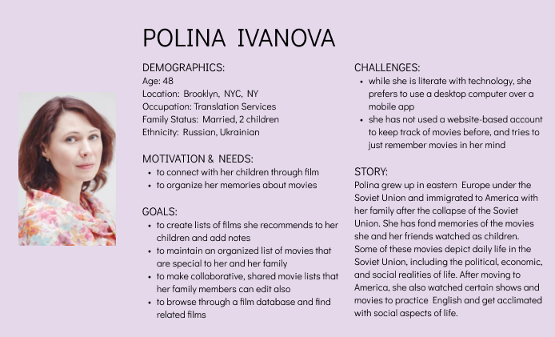
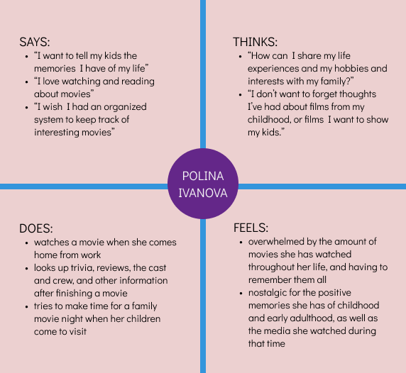
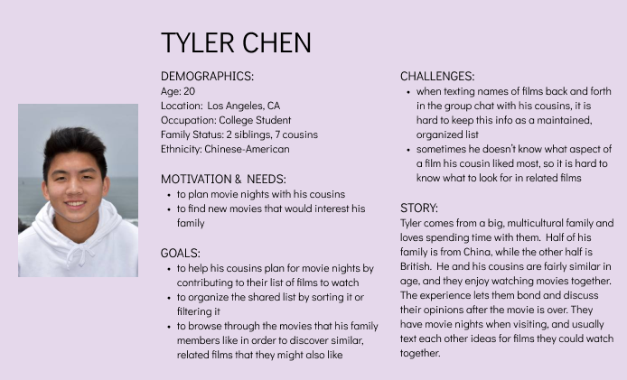
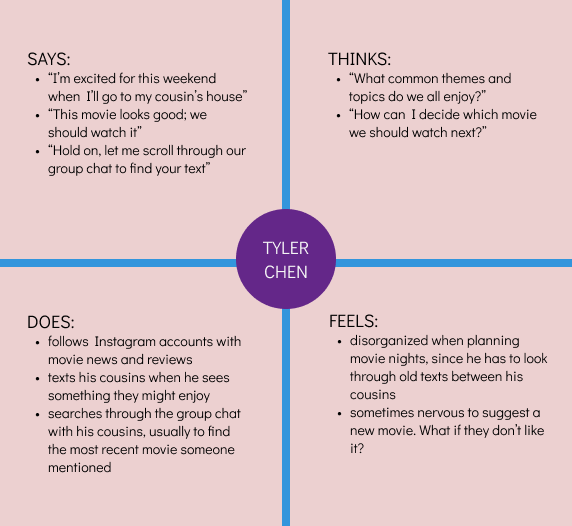
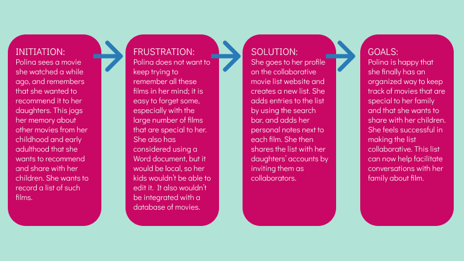
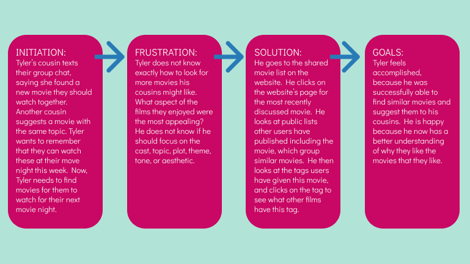

# DH 110 - Assignment 4

## Purpose of UX Storytelling
- Allows the designers to understand what the users are looking for in a website
- Provides insight into why the users want to take certain actions
- Makes clear what issues frustrate users with current solutions

## 2 Tasks
1) Create a list of movies and share it with others so that they can edit it too
2) Browse through lists created by other users featuring a particular movie, as well as other movies with the same tags, in order to find similar and related movies

## Personas and Empathy Maps
### Persona 1: Polina Ivanova

### Persona 2: Tyler Chen

## User Scenarios and Journey Maps
### Polina's Scenario
**Why**

Polina is browsing movies to watch on her TV after coming home from work. She sees “Anywhere But Here,” a movie that she’s watched in the past, pop up. She enjoyed that film, and its depictions of motherhood and daughterhood. She realizes that she wants to recommend this film to her daughters. This jogs her memory about other films she wants to tell her children about. These range from animated Soviet cartoons from her childhood, cult Russian movies, and popular American TV shows that she watched after first moving to the US. Polina wants to make a list of these movies, so she can refer back to it, and not worry about forgetting them. She also wants to add notes about each entry, so that when her daughters look at the list, they know why each entry was added. Additionally, Polina wants this list to be collaborative, so that when she shares it with her family members, they can edit the list and add new movies too. Instead of trying to memorize everything in her head, or using a locally stored Word document, she wants to use an online platform where she can share the list with others.

**How**

Polina turns on her computer, goes to the MovieColab website, and signs in. From her home page, she clicks the “Lists” button under the profile icon in the top right corner. She clicks the button “New List” to create a new list. This changes the display to a list page. On the top of the screen, she edits the title to be “Recommendations”. Below that, there is an option to share the list and invite collaborators. In that box, she types the usernames of her two children, which the search recognizes since she has added their accounts as “Friends”. Next, there is a search bar that searches through a movie database, and allows Polina to type in the name of a movie she wants to add to the list. She searches “Anywhere But Here”, and clicks on the top result to add that movie to the list. Once the movie is added to the list, she clicks on the “Notes” icon next to it and types in her thoughts about it. She then searches and adds some more movies she remembered. When the list is ready, she publishes it, and this notifies her children’s accounts that one of their Friends invited them to edit a list. Polina is happy that she has her thoughts collected and organized in a way that she can share with others.

**Polina's Journey Map**

### Tyler's Scenario
**Why**

Tyler is in class when he receives a text from his cousin in the group chat. She sounds excited about a new movie that is coming out on HBO Max this week and thinks they should all watch it together. The movie is about a fictional mountain-climbing story. Another one of Tyler’s cousins says that it’s from the same director of the movie they watched a couple of weeks ago and liked. Then, another cousin messages them and says that the upcoming movie reminds her of a documentary she watched about climbing. She watched it a long time ago, and thinks it would be fun for them to watch it together. Tyler plans for them to watch these two movies on their next movie night. When the movie night eventually comes, he searches through their text history for messages mentioning movies. He finds the most recent relevant conversation, but he is worried that he may have missed something. He wants to record all the movies they discuss in one central location. Tyler also needs to find the next movie they could watch. He wants to do this by scrolling through profiles for movies in a database and looking at similar or related movies. He aims to enter the movies that his cousins have previously mentioned that they liked, and find other movies that are similar, either by theme, topic, tone, plot, aesthetic, cast/crew, or other metrics. 

**How**

Tyler goes to the MovieColab website and signs in to his account. From his home page, he clicks the “Lists” button under the profile icon in the top right corner. He clicks the button “New List” to create a new list. He adds the movies his cousins just texted him about to the list. He invites them as collaborators to the list by sharing it with their usernames. Next, Tyler clicks on the website’s page for the mountain-climbing documentary. He looks at other public lists made by other users including this documentary. He sees one list of movies about survival and extreme sports. He finds a movie about survival in the desert which seems interesting. He adds this to his list. He then goes back to the documentary’s page on the website. Tyler looks through the tags that users have given to the film. One of these is “cold weather, snowy aesthetic.” He clicks on that tag, and browses through other movies that users have tagged with that tag. He finds a movie about exploration in brutal weather conditions in northern Canada with high ratings from users. He adds this to the list as well. His cousins are notified that he edited their shared list, so they go check it out. They are happy to see these new movies that they had never heard of. Tyler is happy that he was able to organize their ideas, and to successfully find and suggest new movies that they might like to watch together. 

**Tyler's Journey Map**

