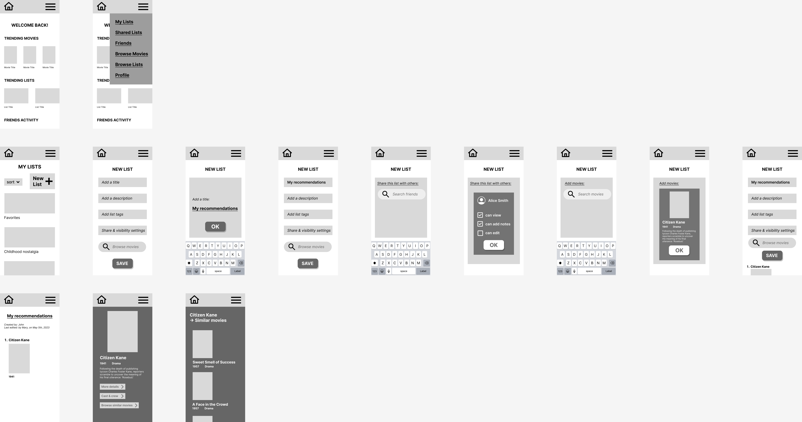
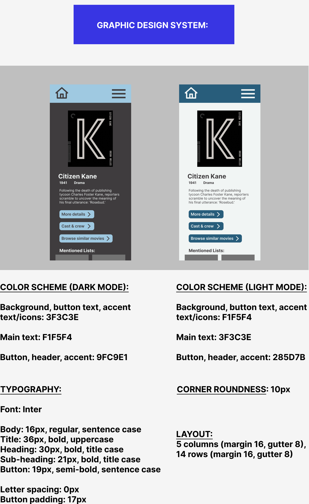

# UI/UX Design Project
### Assignment 8
## Elissa Soykin

# ClapBoard

## Introduction
In this project, I have designed an app for film tracking, specifically with a focus on making (collaborative) movie lists. Users of this app can browse through a database of movies, create their own lists and add movies to lists, share these lists with specified users, and work on shared, collaborative movie lists that other users have invited them to contribute to. Keeping track of movies that a person has watched or wants to remember to watch later is very valuable to those interested in film. Adding a collaborative component will facilitate bonding and discussion between friends who want to watch movies together.

## Design Statement
While apps and websites for movie tracking exist, they rarely offer the opportunity to have collaborative, shared movie lists. My app specifically aims to give users the biggest range of options and control over who can see their lists, whether it is publicly visible to anyone, visible to specified users, or visible and editable by certain users.

## Competitor Analysis
I conducted a heuristic analysis on 2 existing products that aim to address similar goals: Moviemate and Letterboxd. 

https://github.com/elissasoykin/DH110/tree/main/assignment01

Moviemate has a sleek, clean design, and it can more or less accomplish the most critical parts of the task at hand. However, it is lacking in various aspects. This is mostly because in many areas, it has a lack of features and flexibility. For example, users can't change the date they watched a movie, they can't change the order of items in a list, and they can't add items to a list from within the list itself. Also, the 3 buttons on the bottom ("Home", "Watchlists", and "Profile") disappear when clicking on even one movie, and if following a chain of similar movies afterwards. A pro is that it allows for both movies and TV shows, but a con is that it is only mobile-based and has no browser version. Overall, Moviemate lacks in visibility of system status, consistency and standards, help and documentation, and felxibility.

Letterboxd is impressive and comprehensive in the features and functionalities it offers. It is also visually pleasing, with a clean, modern aesthetic. However, Letterboxd can not accomplish my goal of creating a collaborative, shared, group watchlist. For one, Letterboxd lists are either private to only the creator or public to anyone on the internet. Second, even public lists do not allow for multiple editors. Furthermore, Letterboxd has some other issues. For example, the search bar is completely incapable of handling even a single typo in the name of a film, actor, director, etc. Also, there are many ads, which make it slow to load. One plus of Letterboxd which Moviemate does not have and would be especially important for a family app, is that you can add notes and descriptions to movies in lists. Overall, Letterboxd lacks in user control and freedom, recognition rather than recall, and recovery from errors.

https://github.com/elissasoykin/DH110/tree/main/assignment02 

I then conducted a usability test on Moviemate. I found similar results. Users cannot edit the order of the items in a list. The only way to do so is by deleting all the following items in the list, deleting that item, and then re-adding the rest again. If a user deletes an item from a list, there aren't pop-ups to indicate if this was successful. If clicking through a chain of movies, the navigation menu on the bottom disappears, and the only way to return to the main screen is to click through all of the back buttons.

## User Research
https://github.com/elissasoykin/DH110/tree/main/assignment03

I conducted an interview with a potential user, about the current methods they use for movie tracking (which was IMDB for this participant). I learned some things that either caught me by surprise or that I had not considered. For example, what features are and aren't important to the user for tracking movies? She would want to know a synopsis, year, main genres, and what number movies in a series are; she does not care about user ratings and similar metrics. Also, when she saw Letterboxd, she did not like that in the list view, the only information visible is the poster for each movie, and not the title, year, genres, and brief synposis like in IMDB (which she prefers to see). IMDB also has trivia about each movie, which Letterboxd does not have.

## UX Storytelling
https://github.com/elissasoykin/DH110/tree/main/assignment04

Here, I looked at which types of people would use my app, and how they would use it. Here are examples:

## Low-Fidelity Prototype
https://github.com/elissasoykin/DH110/tree/main/assignment05

I then created a low-fidelity prototype of my app, ClapBoard. This includes wireframes and wireflows. The purpose of this prototype is to demonstrate how the app would be organized. It focuses on the content shown on each screen and how it is divided among the screens. It does not focus on the details of the graphic design. The wireframes show the pages/screens of the app. The wireflows show which buttons link pages. Click the links to see it:
https://drive.google.com/file/d/1LFbWNNa8EsbFiZ0x_26f_iErrDsN38Hf/view?usp=sharing
https://www.figma.com/file/LT9o0JeObYxjPbn0RpzaTo/DH-110---assignment-5?type=design&node-id=0%3A1&t=I1Op4iqJVUVTCvzd-1

## Interface Design Variation 
https://github.com/elissasoykin/DH110/tree/main/assignment06

In this part, I created a digitized wireframe/wireflow, graphical interface design variations, color contrast checks, and an interface design style guide. I selected one wireframe, and made many variations. I tested several variations of grid layouts, then typography, then shapes, and then colors. Click the link to see it:
https://www.figma.com/file/xzdasnHL1knBbwi9cvC6pg/DH-110---assignment-6?type=design&node-id=120%3A349&t=qrP01A0qE9gpAyIn-1

For the color schemes, I decided to go with a mostly black-and-white design with dark blue as the accent colors. The reason for the mostly black-and-white is that, since this site is for reading about movies, finding movies, and making lists of movies, I wanted the focus to be on the content. Specifically, the page for a movie may be the first time that a user hears about a movie, or it might be representative of the movie in their minds; in any case, the aesthetic of the page can strongly subconsciously influence their perceptions of the movie. For example, the user might have the "look", "feel", and aesthetic of the movie on the page influenced by the aesthetic of the user interface itself. For this reason, I chose a mostly black-and-white scheme, without harsh or attention-stealing colors. I chose blue because it is typically associated with calmness.

For the typography, I chose Inter, because I wanted a clean, modern, sans serif font. Although the film practice is old, this app is new and designed to keep up with a modern aesthetic and modern audience. As a result, I wanted a neat, clean, aesthetic, sans serif font. Inter is very readable and legible. For the grid layout, I used 5 columns (margin 16, gutter 8), 14 rows (margin 16, gutter 8). For the corner roundness, I chose 10px. My buttons were initially entirely rectangular (0px). I also tried 25px. I found that I did not like the very round buttons, because they seemed to cheapen the look in this particular case, and didn't seem to fit in the sleek and sophisticated, dark design that I was going for. However, I realized I didn't want the buttons to be entirely rectangular either, because then it would be hard to distinguish clickable buttons from decorative boxes or just other non-interactive rectangles. So, I went with 10px, which is slightly rounded.

## High-Fidelity Prototype
https://github.com/elissasoykin/DH110/tree/main/assignment07

Finally, I created the high-fidelity prototype. This built upon my initial low-fidelity prototype, which I updated with the interface design system I created in the previous step. This prototype is interactive. To build it, I first applied my interface design standards to my wireframes. I then added interactivity and animations (to link frames and show what each button click does). 

The tasks supported in the prototype include: Go to home page, Go to menu, Go to my lists, Create a new list, Add title to new list, Share new list with users and choose permissions, Search and add movies to new list, Save new list, Click on a movie to go to its page, Browse through movies similar to a given movie.

Wireflow with design:
(Note: to see the wireframe with the wireflow arrows in high quality, use the figma link in the section below)

Link to interactive prototype:
https://www.figma.com/file/EQJvtb8HBGJ06OVN41tYkM/DH-110---assignment-7?type=design&node-id=201%3A54&t=bc0aXyLkmcgDy1Rl-1

